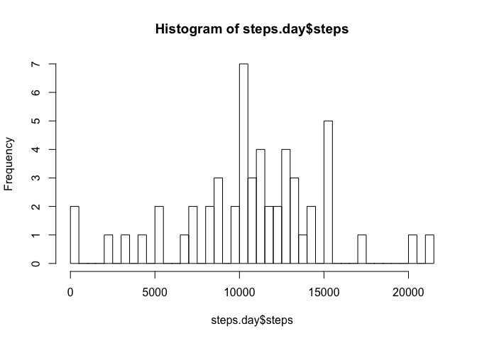
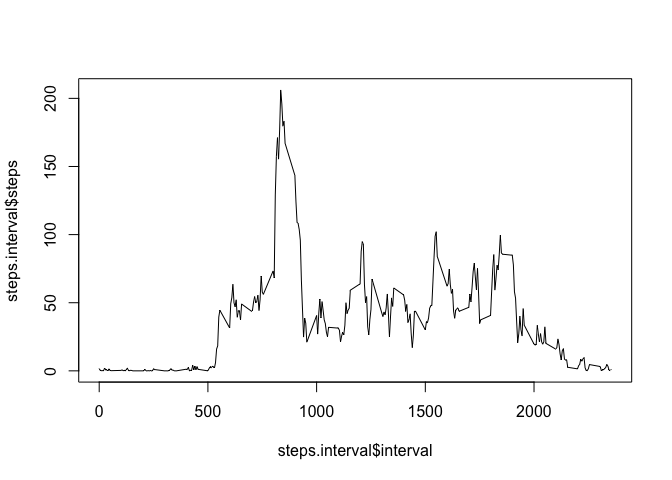
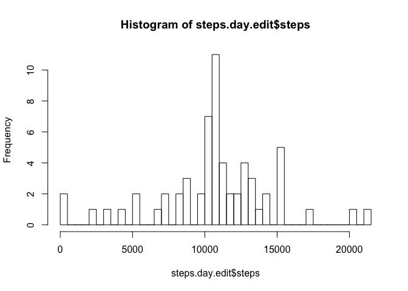
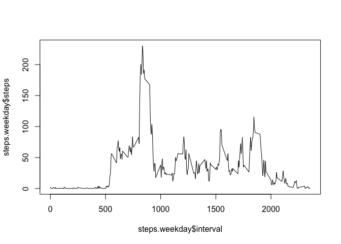
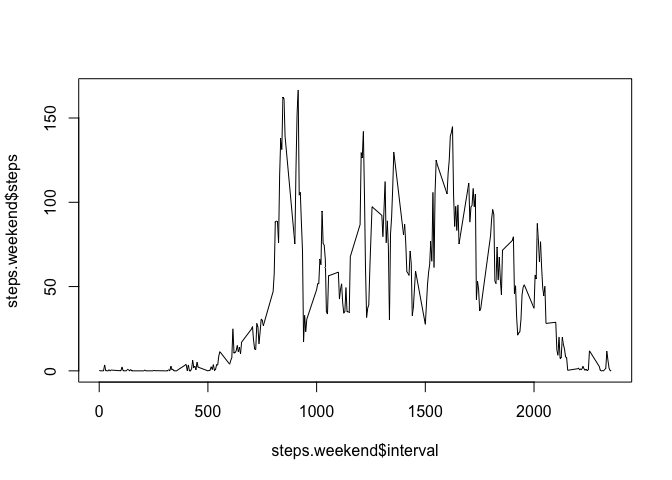

# Reproducible Research: Peer Assessment 1

## Loading and preprocessing the data


```r
  url <- "https://d396qusza40orc.cloudfront.net/repdata%2Fdata%2Factivity.zip"
  download.file(url, destfile = "activity.zip", method="curl")
  unzip("activity.zip")
  activity <- read.csv("activity.csv")
```


## What is mean total number of steps taken per day?


```r
  library(dplyr)
```

```
## 
## Attaching package: 'dplyr'
## 
## The following object is masked from 'package:stats':
## 
##     filter
## 
## The following objects are masked from 'package:base':
## 
##     intersect, setdiff, setequal, union
```

```r
  activity.day <- group_by(activity, date)
  steps.day <- summarize(activity.day, steps = sum(steps, na.rm = FALSE))
  hist(steps.day$steps, breaks = nrow(steps.day))
```

 

```r
  mean.steps <- mean(steps.day$steps, na.rm = TRUE)
  median.steps <- median(steps.day$steps, na.rm = TRUE)
  cat("The mean number of steps taken per day is", mean.steps)
```

```
## The mean number of steps taken per day is 10766.19
```

```r
  cat("The median number of steps taken per day is", median.steps)
```

```
## The median number of steps taken per day is 10765
```

## What is the average daily activity pattern?


```r
  activity.interval <- group_by(activity, interval)
  steps.interval <- summarize(activity.interval, 
                              steps = mean(steps, na.rm = TRUE))
  plot.ts(steps.interval$interval, steps.interval$steps, type = "l")
```

 

```r
  most.steps <- which.max(steps.interval$steps)
  cat("The interval with the most number of steps is", 
      steps.interval$interval[most.steps])
```

```
## The interval with the most number of steps is 835
```
## Imputing missing values


```r
  na.count <- sum(is.na(activity$steps))
  cat("The number of missing values in the dataset is", na.count)
```

```
## The number of missing values in the dataset is 2304
```

```r
  activity.edit <- activity
  interval.means <- steps.interval$steps
  interval.means <- rep(interval.means, times = 61)
  activity.edit <- mutate(activity.edit, mean.values = interval.means)
  
  for (i in 1:nrow(activity.edit)) {
      if (is.na(activity.edit$steps[i])) {
        activity.edit$steps[i] <- activity.edit$mean.values[i]
      }
  }

  activity.edit <- group_by(activity.edit, date)
  steps.day.edit <- summarize(activity.edit, steps = sum(steps))
  hist(steps.day.edit$steps, breaks = nrow(steps.day.edit))
```

 

```r
  mean.steps.edit <- mean(steps.day.edit$steps)
  median.steps.edit <- median(steps.day.edit$steps)
  cat("The mean number of steps taken per day is", mean.steps.edit)
```

```
## The mean number of steps taken per day is 10766.19
```

```r
  cat("The median number of steps taken per day is", median.steps.edit)
```

```
## The median number of steps taken per day is 10766.19
```

```r
  cat("The mean number of steps per day does not change when NA values are 
      removed")
```

```
## The mean number of steps per day does not change when NA values are 
##       removed
```

```r
  cat("The median number of steps per day becomes the mean number of steps
      per day when the NA values are removed")
```

```
## The median number of steps per day becomes the mean number of steps
##       per day when the NA values are removed
```

## Are there differences in activity patterns between weekdays and weekends?


```r
  library(ggplot2)
```

```
## Warning: package 'ggplot2' was built under R version 3.1.3
```

```r
  days <- as.Date(activity.edit$date)
  days <- weekdays(days, abbreviate = FALSE)
  activity.edit$Days.of.Week <- days
  activity.edit$Weekdays <- ifelse(weekdays(as.Date(activity.edit$date))
                                   %in% c('Saturday','Sunday'), "weekend", "weekday")

  activity.weekday <- filter(activity.edit, Weekdays == "weekday")
  activity.weekend <- filter(activity.edit, Weekdays == "weekend")

  activity.weekday.interval <- group_by(activity.weekday, interval)
  steps.weekday <- summarize(activity.weekday.interval, 
                              steps = mean(steps))

  activity.weekend.interval <- group_by(activity.weekend, interval)
  steps.weekend <- summarize(activity.weekend.interval, 
                              steps = mean(steps))

  plot1 <- plot.ts(steps.weekday$interval, steps.weekday$steps, type = "l")
```

 

```r
  plot2 <- plot.ts(steps.weekend$interval, steps.weekend$steps, type = "l")
```

 


